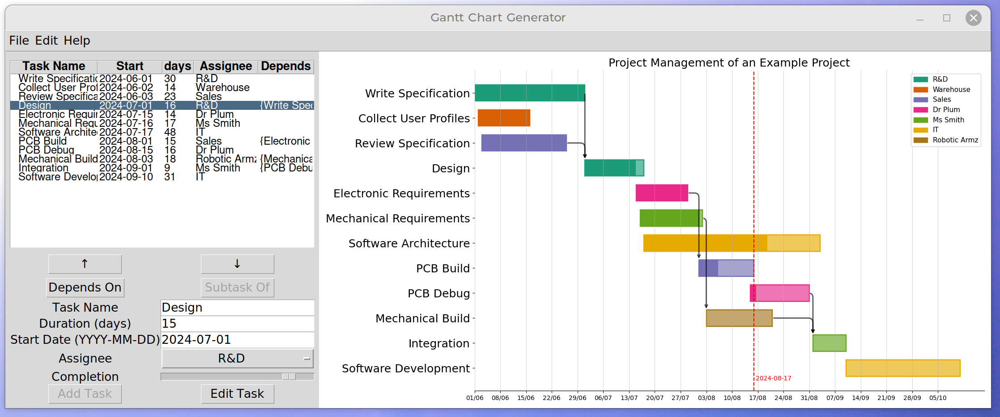
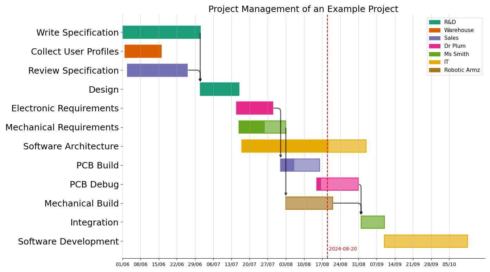

# FasttGantt
Gantt Chart Generator - aimed at creating graphics for reports

This is a very simple Gantt Chart generator for creating graphics in reports and presentations.  Outputs can be in bitmap (png, etc) or vector (svg, etc) and they look like this:

Files can be imported from and saved to a spreadsheet.

It is available under GPL 3.0 - its free - please feel free to improve and modify.